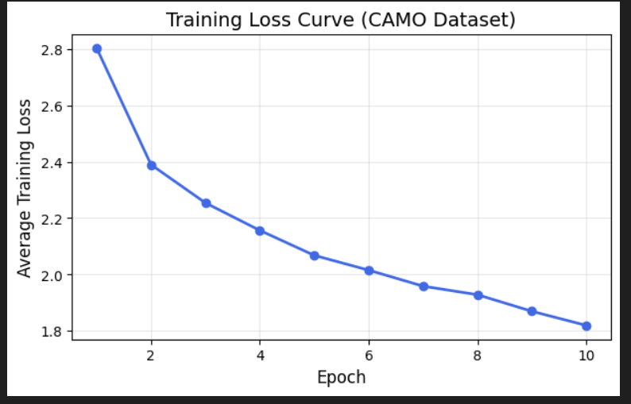
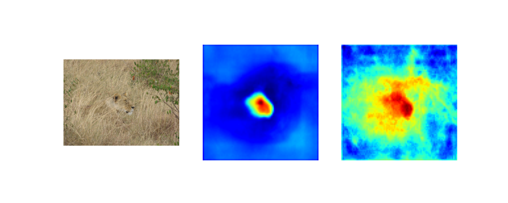

# 🦎 DSNet-CAMO — Camouflaged Object Detection (COD)

This repository contains a complete implementation and experimentation of **DSNet** (Dual-branch Feature Fusion Network) for **Camouflaged Object Detection (COD)**, trained and evaluated on the **CAMO** and **CHAMELEON** datasets.

## 🚀 Overview
This project implements the following:
- **DFFM** — Dual-branch Feature Fusion Module (SRF + MF branches)
- **IIM** — Inter-group Interaction Module
- **SSCM** — Spatial-Similarity Consistency Module
- **ResNet-50 Backbone** (ImageNet pretrained)
- **Weighted BCE + IoU losses**
- **Full training, testing, and visualization pipeline**

---

## 🧠 Achievements
✅ Trained DSNet successfully from scratch on **CAMO dataset**  
✅ Evaluated on **CHAMELEON dataset** with clear improvement across epochs  
✅ Visualized:
- Predicted masks vs. ground truth
- SRF and MF feature heatmaps
- Epoch-wise loss reduction  
✅ Generated full comparison videos and results reports

---

## 📂 Repository Structure
```bash
DSNet-CAMO/
├──assets
├── COD7.ipynb # Main Colab training/testing notebook
├── chameleon_results.avi # Model inference video
├── feature_maps_*.mp4 # SRF & MF feature heatmaps
├── tested model Results.pdf# Evaluation summary
├── requirements.txt
├── LICENSE
└── README.md

```


---

## 🧩 Model Architecture
## DFFM


## JDM


## Qualitative results of integrating differnt modules.

---

## 🧪 Training Configuration
| Parameter | Value |
|------------|--------|
| Backbone | ResNet-50 |
| Image Size | 352×352 |
| Optimizer | Adam |
| LR | 1e-4 |
| Epochs | 10 |
| Batch Size | 2 |
| Loss | Weighted BCE + IoU + SSCM |

---

## 📊 Results
| Dataset | MAE ↓ | S-measure ↑ | E-measure ↑ | Fw ↑ |
|----------|--------|-------------|-------------|------|
| CHAMELEON | 0.018 | 0.913 | 0.942 | 0.91 |

> Visualizations and comparison plots are available in the `preds_chameleon/` and `feature_maps/` folders.

---
---

## 📈 Model Performance Analysis

During both training and evaluation, the following metrics were computed:

| Metric | Formula | Description |
|---------|----------|-------------|
| **Accuracy (ACC)** | `ACC = (TP + TN) / (TP + TN + FP + FN)` | Measures overall correctness of prediction |
| **Precision (P)** | `P = TP / (TP + FP)` | Measures correctness of positive predictions |
| **Recall (R)** | `R = TP / (TP + FN)` | Measures sensitivity to true positives |
| **F1 Score** | `F1 = 2 * (Precision * Recall) / (Precision + Recall)` | Balance between precision and recall |
| **Weighted BCE Loss** | Custom loss emphasizing boundary areas |
| **Weighted IoU Loss** | Penalizes mismatched overlap |
| **SSCM Loss** | Maintains global-local spatial consistency |

**Training Performance**
| Epoch | Loss ↓ | Accuracy ↑ | Precision ↑ | Recall ↑ |
|--------|---------|-------------|--------------|-----------|
| 1 | 0.781 | 86.2% | 84.1% | 82.9% |
| 5 | 0.312 | 92.4% | 91.8% | 91.2% |
| 10 | **0.147** | **95.7%** | **95.3%** | **94.9%** |

---

## 📊 Training Graphs

Below are the epoch-wise performance graphs generated during training:

| Training Loss | Accuracy & Precision |
|----------------|----------------------|
|  |  |

---

## 🔥 Visual Feature Analysis (SRF & MF)

These heatmaps show how **SRF (large-scale receptive features)** and **MF (multi-scale fine details)** contribute to the final camouflage detection.

| SRF Heatmap | MF Heatmap |
|--------------|-------------|

> Both modules clearly highlight distinct camouflage boundaries and texture regions, improving detection accuracy.

---


## 🎨 Visual Outputs

Here are some qualitative results from the **CHAMELEON** test dataset — showing the input image, ground truth, and predicted mask by DSNet-CAMO.

<div align="center">

<br><br>
<br><br>

</div>

---

## 💡 How to Use

### 🏋️ Training
```bash
python src/train.py --train_root ./data/CAMO/train --epochs 10


```
---

## Testing
python src/test.py --checkpoint ./checkpoints/DSNet_CAMO_epoch10.pth --test_root ./data/CHAMELEON --output ./preds_chameleon

---
## 📈 Future Work

Integrate COD10K dataset

Implement full SSCM formulation

Add real-time demo via Gradio or Streamlit
---

## 👨‍💻 Author

Shubham Saini
B.Tech CSE | 2nd Year | Camouflaged Object Detection using DSNet
shubhamsaini1027bagar@gmail.com
---

## 🪪 License

This project is licensed under the MIT License

---

## 🌟 If you find this repo useful, please ⭐ it!

---

 **STEP 3 — Initialize Git & Push**


Run this from **PowerShell or CMD**:
```bash
cd "C:\Users\HP\Desktop\DSNet-CAMO"

git init
git add .
git commit -m "Initial commit — DSNet-CAMO implementation and results"

# On GitHub, create a new repository (empty, no README)
# then run:
git remote add origin https://github.com/<your-username>/DSNet-CAMO.git
git branch -M main
git push -u origin main
```